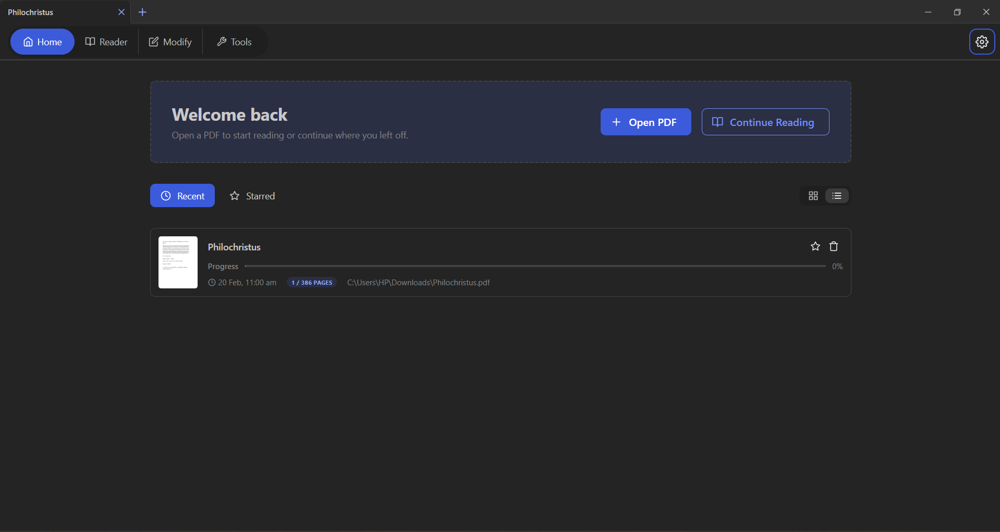
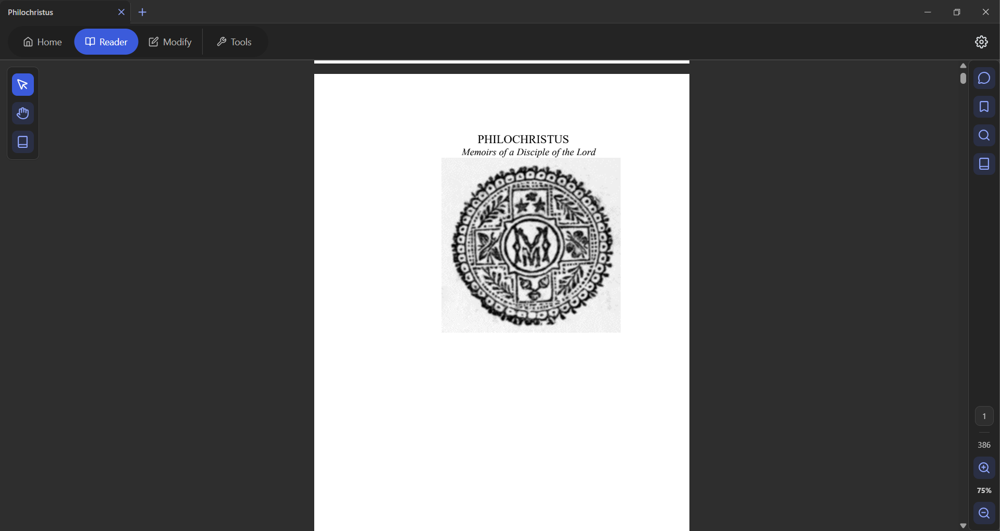
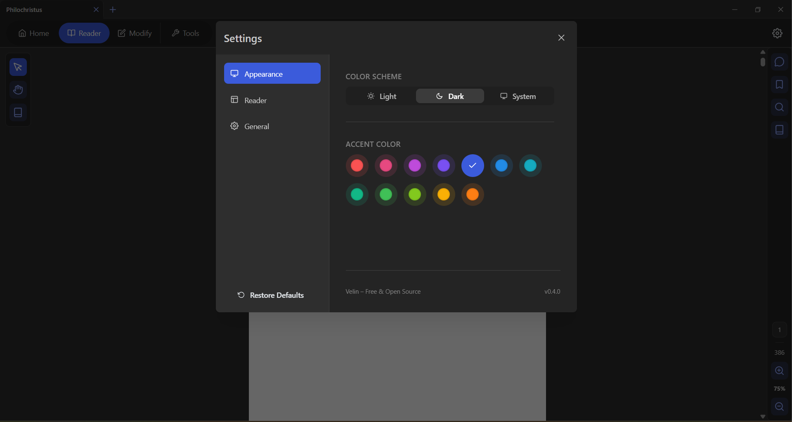
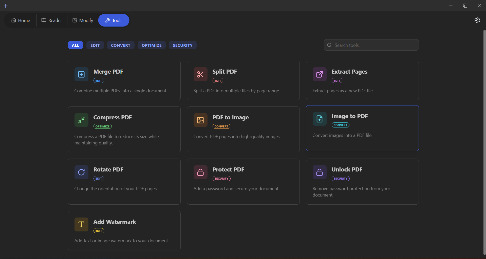

# Velin

A modern, high-performance PDF reader built with **Tauri**, **Rust**, and **React**. Velin focuses on speed, smooth interactions, and a premium reading experience.

> [!IMPORTANT]  
> **Project Status: Active Development**
>
> Velin is still under active development. Core systems are functional and performance-focused, but the application is evolving rapidly. Some features may change, and minor bugs are expected.

---

## 📸 Showcase

### Modern Home Screen

A clean and intuitive landing page to manage and access your PDF collection.


### High-Performance Reader

Experience lag-free reading, instant zooming, and smooth text interactions.


### Personalized Themes

Switch between various themes — including a full dark theme — to match your workspace and reduce eye strain.


### Everything You Need for PDFs

Merge, split, protect, unlock, watermark, and organize PDF files with a complete set of powerful tools.


---

## 🚀 Tech Stack

Velin leverages a modern stack to deliver a native-feel desktop experience with web flexibility:

- **Framework**: Tauri (v2)
- **Backend**: Rust (High-performance PDF processing and OS integration)
- **Frontend**: React + TypeScript
- **UI System**: Mantine
- **State Management**: Zustand
- **Virtualization**: @tanstack/react-virtual
- **Internationalization**: react-i18next
- **Build Tool**: Vite

---

## 🛠 Features (Current Progress)

### 📄 Core PDF Engine

- [x] **Virtual PDF Rendering** – Efficient handling of massive PDFs with minimal memory footprint.
- [x] **Instant Zoom** – CSS-first zoom scaling for zero-latency interaction (Ctrl + Scroll).
- [x] **High-Performance Text Selection** – Optimized DOM structure for smooth text highlighting.
- [x] **Text Fragment Extraction** – Backend-optimized text fragment alignment.
- [x] **Resume Where You Left Off** – Automatically restores the last-read page and position.

### 🏠 Application Experience

- [x] **Modern Home Screen** – Clean landing screen with quick access to documents.
- [x] **Recent Files** – Automatically tracks recently opened PDFs.
- [x] **Starred Documents** – Mark important PDFs for quick access.
- [x] **Persistent Settings** – App preferences are saved across sessions.
- [x] **Theme & Dark Mode Support** – Multiple theme colors with a fully supported dark theme.

### 📚 Integrated Dictionary

- [x] **Built-in Dictionary** – Lookup word meanings directly inside the reader.
- [x] **Fast Word Detection** – Optimized text selection integration.
- [x] **Local Processing** – Designed for speed and minimal overhead.

### 🗂 Sidebar & Navigation

- [x] **Bookmarks Panel** – Navigate using embedded PDF bookmarks.
- [x] **Smooth Navigation** – Jump between pages instantly.

### 🛠 PDF Tools

A growing suite of built-in PDF utilities, all accessible from the tools screen:

- [x] **Merge PDF** – Combine multiple PDFs into a single document.
- [x] **Split PDF** – Separate a PDF into multiple files by page range.
- [x] **Extract Pages** – Save specific pages as a new PDF file.
- [x] **Compress PDF** – Reduce file size without losing quality.
- [x] **PDF to Image** – Convert PDF pages into high-quality images.
- [x] **Image to PDF** – Create a PDF from a collection of images.
- [x] **Rotate PDF** – Change the orientation of your PDF pages.
- [x] **Protect PDF** – Add a password and secure your document.
- [x] **Unlock PDF** – Remove password protection from your PDF.
- [x] **Watermark** – Add text or image watermarks to your PDF.

### 🌐 Internationalization

- [x] **English (en)** – Full English language support.
- [x] **Hindi (हिन्दी)** – Complete Hindi language interface.
- [x] **Extensible i18n** – Built on react-i18next, ready for additional languages.

### ⚡ Performance

- [x] Significant optimizations to PDF pixel rendering and caching.
- [x] Virtualized page rendering for large documents.
- [x] Reduced unnecessary re-renders across the app.
- [x] Optimized tool execution with minimal overhead.

### 💬 In Progress

- [ ] **Modify Screen** – Edit and annotate PDF pages directly.
- [ ] **Comments & Annotations** – PDF annotations and inline commenting.
- [ ] **Advanced Search**
- [ ] **Highlight Management**
- [ ] **Cross-document indexing**

---

## 🤝 Open Source & Contributions

Velin is an open-source project, and contributions are welcome.

### How You Can Help

- **Testing** – Report bugs or performance issues on different operating systems.
- **Feedback** – Suggest UI/UX improvements or new features.
- **Code** – Check open issues or submit a Pull Request.

### Contribution Protocol

1. Fork the repository.
2. Create a feature branch (`git checkout -b feature/amazing-feature`).
3. Commit your changes (`git commit -m 'Add amazing feature'`).
4. Push to the branch (`git push origin feature/amazing-feature`).
5. Open a Pull Request.

---

## 📦 Getting Started

### Prerequisites

- Rust
- Node.js (pnpm recommended)

### Setup

1. Clone the repository:

```bash
git clone https://github.com/mpannu03/velin.git
```

2. Install dependencies:

```bash
pnpm install
```

3. Run in development mode:

```bash
pnpm velin:dev
```

---

## 📄 License

Velin is licensed under the **GNU General Public License v3.0**. See the [LICENSE](LICENSE) file for more details.

---

Developed with ❤️ using Tauri and Rust.
