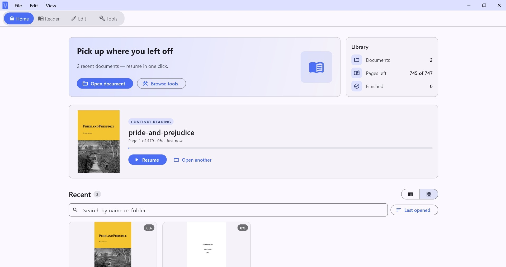
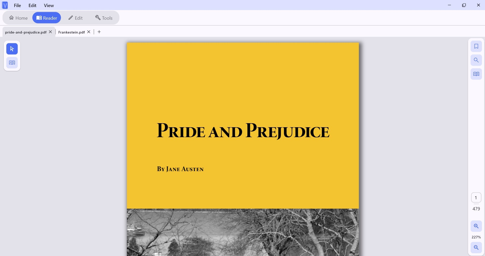
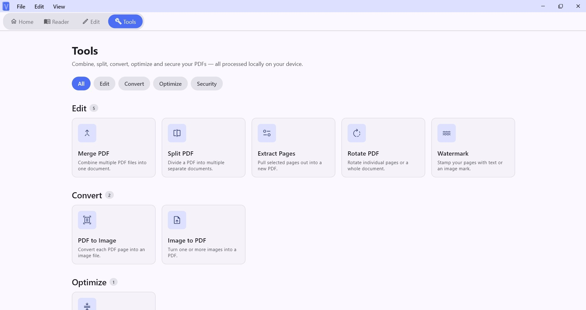
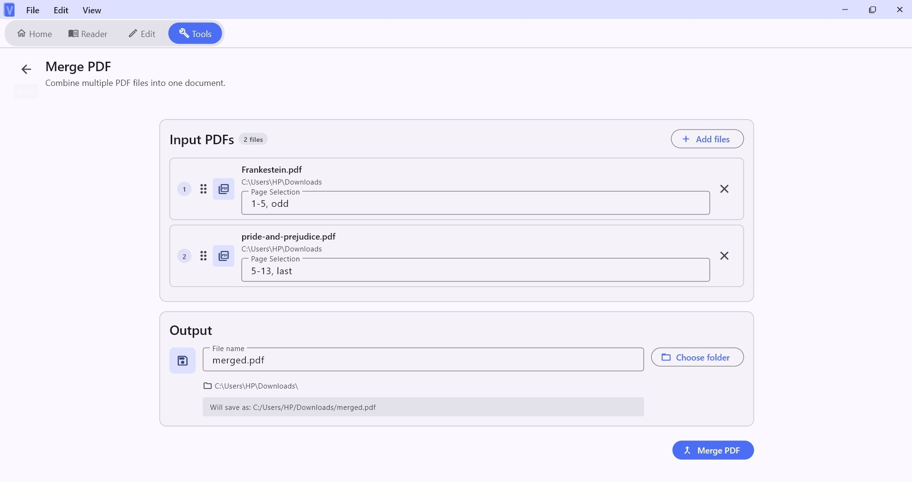

# Velin

**A free, open-source PDF application built with Flutter.**

Velin is a modern PDF reader and productivity suite focused on providing useful PDF workflows in a fast, clean, and native-feeling application across desktop and mobile.

[](https://github.com/mpannu03/velin/releases)
[](https://github.com/mpannu03/velin/blob/main/LICENSE)

## Screenshots

### Home



### PDF Reader



### PDF Tools



### Merge PDF



## Features

Velin currently provides a growing collection of PDF functionality, including:

* 📖 **PDF reader** with fast document navigation
* 📑 **Multiple open documents** with persistent document workspaces
* 🔎 **Text selection and search**
* 📚 **Dictionary lookup** for selected text
* 🛠️ **PDF tools** for common document workflows
* 🔀 **Merge PDF** files
* ✂️ **Split PDF** documents
* 📄 **Extract PDF pages**
* 🔄 **Rotate PDF pages**
* 🖼️ **PDF to image** conversion
* 📑 **Image to PDF** conversion
* 🗜️ **Compress PDF** files
* 🔐 **PDF security tools**
* 🌗 **Light and dark themes**
* 🌍 **Localization**
* 📱 **Responsive interface** designed for desktop and mobile

The available tools and capabilities will continue to expand as Velin develops.

## Download

The latest version of Velin is available from the GitHub Releases page.

**Latest release: [Velin 0.5.0](https://github.com/mpannu03/velin/releases/tag/v0.5.0)**

Download the appropriate build for your platform from the release assets.

> Velin 0.5.0 is currently released for desktop platforms. Mobile support is actively under development and will be released separately when ready.

## Why Velin?

There are many PDF applications, but useful PDF workflows are often scattered across different products.

Velin aims to bring common PDF tasks together in one application while keeping the experience straightforward.

### Open Source

Velin is free and open source. The source code is available for anyone to inspect, use, learn from, or contribute to.

### Privacy

Velin is designed around local document workflows. Your PDF files do not need to be uploaded to a remote service simply to perform common PDF operations.

### Native-feeling experience

Velin is built with Flutter and designed to provide a natural experience across supported platforms.

The goal is not to reproduce a web application inside an application window, but to provide an interface that feels appropriate for each platform.

### Practical tools

Velin focuses on everyday PDF operations rather than trying to become an unnecessarily complicated document editor.

The tool system is designed so additional PDF workflows can be added over time without making the reader experience more complicated.

## Technology

Velin is built with:

* [Flutter](https://flutter.dev/)
* [Dart](https://dart.dev/)
* [pdfrx](https://pub.dev/packages/pdfrx)
* [pdf_cos](https://pub.dev/packages/pdf_cos)

The application uses a feature-oriented architecture with separate contracts, data access, services, and PDF engine implementations. This keeps the UI and document workflows independent from the underlying PDF implementation.

## Supported Platforms

Velin is designed as a responsive application with desktop and mobile as first-class platforms.

### Currently Released

* Windows
* macOS
* Linux

### Currently in Active Development

* Android
* iOS

Mobile development is actively underway. The application architecture and responsive UI are being developed to provide a first-class experience on smaller screens rather than treating mobile as a reduced version of the desktop application.

Platform builds may not always be released simultaneously.

## Getting Started

### Requirements

Install [Flutter](https://flutter.dev/) and make sure it is available on your `PATH`.

Clone the repository:

```
git clone https://github.com/mpannu03/velin.git
cd velin
```

Install dependencies:

```
flutter pub get
```

Run the application:

```
flutter run
```

### Build

To build a release for a supported desktop platform, use the corresponding Flutter build command.

For example, on Windows:

```
flutter build windows --release
```

Refer to the Flutter documentation for platform-specific build requirements.

## Project Structure

Velin follows a feature-oriented architecture with a clear separation between application concerns, core contracts, data access, services, PDF engines, and UI features.

The main project structure is:

```
lib/
├── app/
├── core/
├── data/
├── engine/
├── features/
├── l10n/
├── services/
└── shared/
```

### Architecture Principles

* `core/` contains contracts and domain concepts.
* `data/` contains data access and persistence-related functionality.
* `engine/` contains concrete PDF and document processing implementations.
* `services/` contains reusable application-level services.
* `features/` contains user-facing functionality and feature-specific UI.
* `shared/` contains reusable UI components, extensions, and utilities.
* `app/` contains application-level configuration and orchestration.
* `l10n/` contains localization resources and generated localization code.

Velin intentionally keeps the architecture straightforward and avoids unnecessary abstraction and code generation.

## Roadmap

Velin is actively developed. Areas of ongoing development include:

* Mobile support
* Additional PDF tools
* Improvements to document workflows
* UI and responsive layout improvements
* Additional localization
* Performance improvements
* Additional platform support and release improvements

The roadmap may evolve as the project develops.

## Contributing

Contributions are welcome.

Before making a significant change, please consider opening an issue to discuss the idea first.

For development guidelines, architecture conventions, testing requirements, and contribution workflow, see [CONTRIBUTING.md](CONTRIBUTING.md).

## Code of Conduct

Please read and follow the [Code of Conduct](CODE_OF_CONDUCT.md) when participating in the project.

## Security

If you discover a security vulnerability, please do not report it through a public GitHub issue.

See [SECURITY.md](SECURITY.md) for information about reporting security vulnerabilities.

## License

Velin is open source and distributed under the project's existing license.

See the [LICENSE](LICENSE) file for the complete license terms.

## Acknowledgements

Velin is built with the help of the open-source Flutter and Dart ecosystem and the libraries that make PDF rendering and processing possible.

Special thanks to the maintainers and contributors of the projects Velin depends on.
